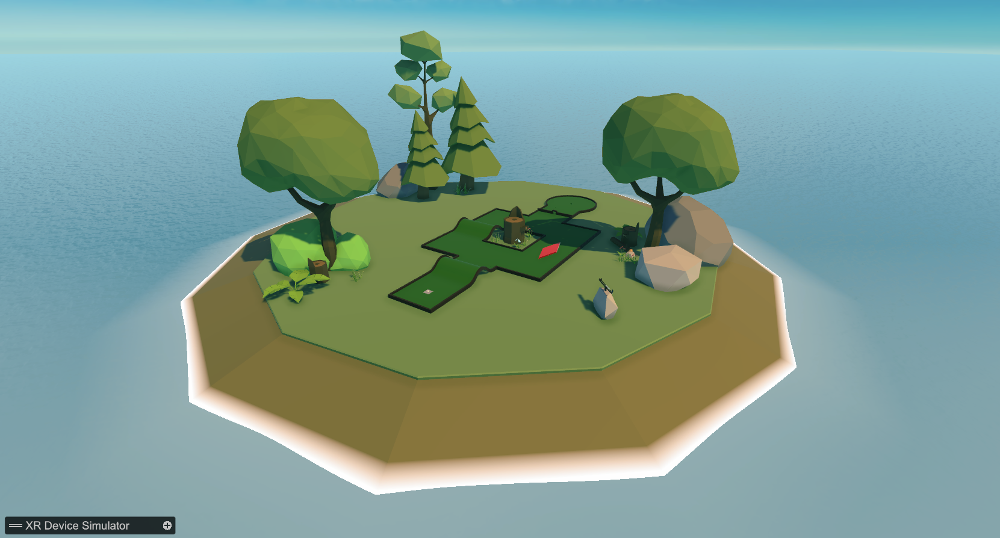
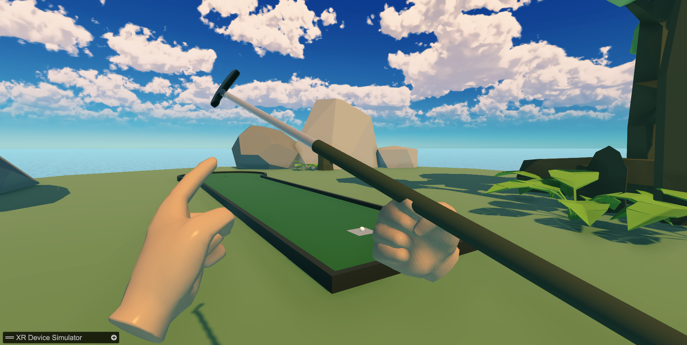
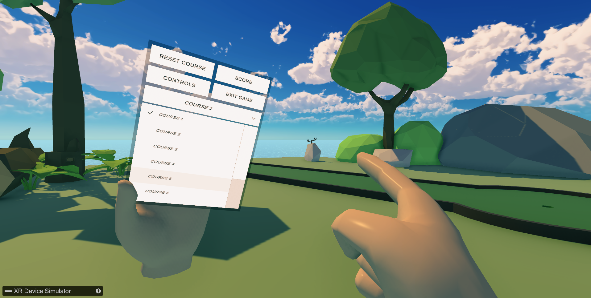
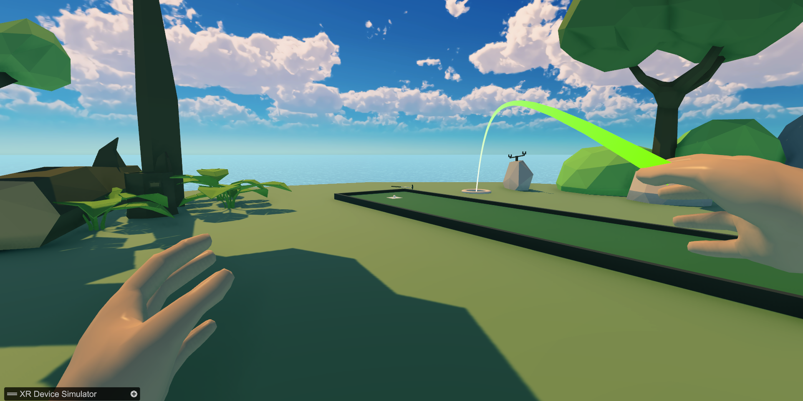
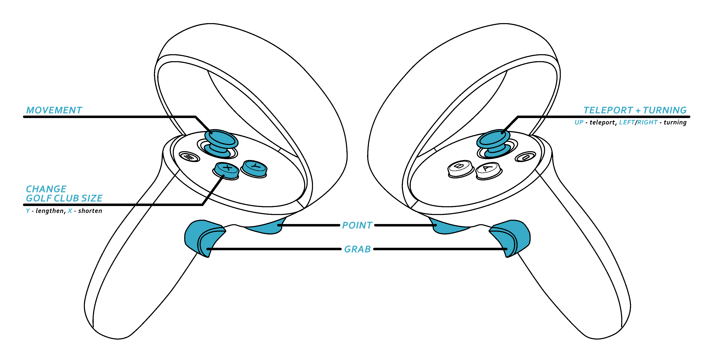

# VR Minigolf Game

An immersive, physics-based virtual reality minigolf experience built from scratch using the Unity engine. The game features realistic putter-to-ball physics interaction, multi-course track selection, real-time score tracking, dynamic hand animations, and an adjustable-length golf club mechanism to fit your physical height.

---

## Repository Structure

- `Unity Project/` - The complete Unity development environment containing all source assets, scenes, models, and scripts.
- `Build/` - Pre-compiled executable binaries ready to deploy directly onto your VR headset or XR simulator hardware.

---

## Game Features and Showcases

### Immersive VR Environment
Step into a vibrant low-poly coastal environment custom-tailored for spatial immersion.

### Realistic Physics and Adjustable Putter
Grab the club using native controller physics. Toggle your left primary and secondary buttons to extend or shorten the physical length of the shaft dynamically to match your playing posture.

### Hand Menu UI and Score Tracking
An interactive wrist-mounted canvas UI allows you to switch between 10 distinct golf courses, view persistent scorecards, look up controls, or reset your current ball placement.

### Teleportation Navigation
Navigate around large courses smoothly using a standard arc-based raycast teleportation system.

---

## Hardware Control Mapping

The game uses standard XR controller layouts. Refer to the diagram below for the default mapping:

### Core Teleportation and Movement
* **Right Thumbstick (Up)**: Projects an arc raycast curve onto the ground plane; release to instantly teleport to the destination.
* **Right Thumbstick (Left/Right)**: Snaps your rotation view left or right for easy alignment over the ball.

### Interaction and Putter Customization
* **Grip Trigger**: Squeeze to grab and physically wield the putter handle.
* **Index Trigger**: Performs contextual point interactions on the wrist canvas dropdowns and buttons.
* **Left Button `Y` (Primary)**: Extends the shaft length downward (increments of $-0.005$ units) to lengthen the club.
* **Left Button `X` (Secondary)**: Retracts the shaft length upward (increments of $+0.005$ units) to shorten the club.

---

## Technical Implementation and Architecture

The gameplay mechanics are driven by an interconnected set of C# scripts managing physics thresholds, UI states, and hardware events:

### 1. Physics and Interaction Foundations
* **`HandPresencePhysics.cs`**: Maps virtual tracking anchors to physical hands by overriding velocities (`_rb.velocity = (target.position - transform.position) / Time.fixedDeltaTime`). If hands clip into heavy collision geometry, it calculates spatial separation limits and spawns a translucent semi-transparent "ghost hand" model to maintain spatial immersion without causing visual jitter.
* **`Ball.cs`**: Manages rigid-body threshold dampening. To prevent realistic physics engines from drifting micro-movements indefinitely, the script checks if the absolute speed drops under a specific vector value (`magnitude < 0.2`). If it falls beneath this threshold, it snaps the ball to a full rest state (`Vector3(0,0,0)`).

### 2. Scorekeeping and Rules Engine
* **`HitCounter.cs`**: Detects valid putter impacts. It listens to structural trigger bounds on the club head (`OnTriggerExit`) to dynamically broadcast updates over to the central UI panel whenever a stroke occurs.
* **`HoleCheck.cs`**: Monitors the goal zones inside the courses (`OnTriggerEnter`). It identifies whether an overlapping element carries the explicit `"Ball"` tag, logs the successful hole-in, and sets the active state of the ball to `false` to conclude the current level.

### 3. Interface Lifecycle and State Controllers
* **`MenuScript.cs`**: The central master state machine managing canvas arrays (Main Menu, Scoreboard, Controls). It handles level streaming configurations (`SceneManager.LoadScene`), tracks score indices across all 10 courses, and powers structural reset protocols—clearing persistent values, stopping inertia loops, and resetting elements smoothly to their base transforms.
* **`ChangeLength.cs`**: Checks input conditions while holding the putter to modify structural constraints on local vector axes (`putterBottom.transform.localPosition`). It applies bounds clamping to keep adjustments within safe minimum and maximum lengths (`-0.6f` to `0.0f`).
* **`AnimateHandOnInput.cs`**: Reads analog values from index triggers and side grip buttons, translating inputs dynamically to drive blended animations inside the controller's skeleton rig.

---

## Installation and Specifications

### System Requirements
* **Unity Version**: Built using **`2021.3.9f1`** (LTS release recommended).
* **XR Plugin Architecture**: Uses the standard **Unity XR Interaction Toolkit** tracking setup.

### Development Setup
1. Clone this repository to your local drive.
2. Launch Unity Hub, click **Add**, and select the `Unity Project` directory path.
3. Open the target scene repository located at `Assets/Scenes/Courses/01.unity`.
4. Ensure your VR headset link layer (Oculus Link, OpenXR, Virtual Desktop) is connected, then press **Play** inside the Unity Editor.

---

## Disclaimer

This README file was generated using Google Gemini, so it might have gotten some things wrong. What I checked looks correct, but be aware of this.